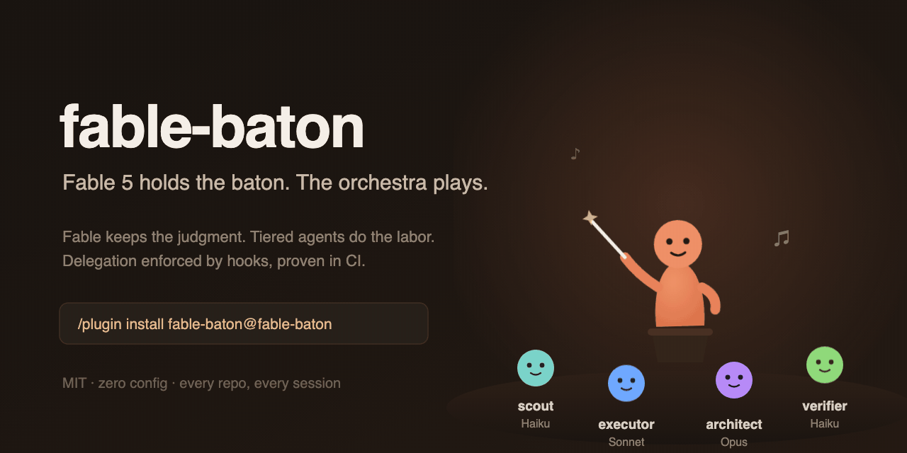
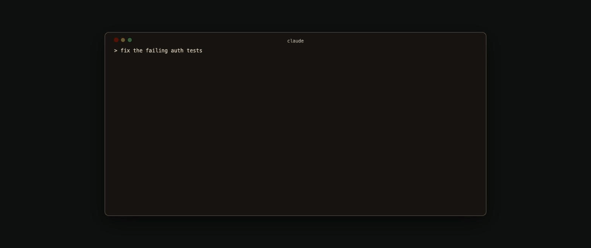

# fable-baton 🪄

[](https://github.com/realgarit/fable-baton/actions/workflows/ci.yml) [](LICENSE)



**Fable 5 holds the baton. The orchestra plays.**

A Claude Code plugin that makes Fable 5 the orchestrator. Fable keeps the judgment, tiered subagents on Opus, Sonnet and Haiku do the labor. Install once and every new session in every repo starts this way.

**[Why](#why) · [Benchmark](#benchmark) · [How it works](#how-it-works) · [What you'll see](#what-youll-see) · [Install](#install) · [Day-to-day](#day-to-day) · [Alternatives](#alternatives)**

## Why

- **Fable time is precious.** It is the strongest model on a Claude subscription and the most expensive one to burn on grep runs and boilerplate. fable-baton routes each piece of work to the cheapest tier that can do it well, so you can keep Fable 5 as your daily model.
- **No more switcheroo.** When Fable time runs dry, Opus quietly takes over your session. With fable-baton, Fable spends its tokens on judgment only, Opus does the heavy work below it as a subagent, and Fable stays the one holding the context.

The tiers are Opus, Sonnet and Haiku today. Later this should open up to other models and structures.

## Benchmark

Numbers from a small controlled test, run 2026-07-13 on Claude Code 2.1.197 with plugin v1.3.0. The project was a zero dependency Node.js library with a test suite. Three tasks: fix two seeded bugs, implement a feature from a spec in TODO.md, and review the codebase for bugs. Each task ran headless via claude -p, twice with the plugin off and twice with it on, same session model (Fable 5) in both. Success was checked from outside the session: the test suite had to pass (for the feature task against hidden tests the session never saw) and the review had to find both seeded bugs. All 12 runs passed.

| task | plugin off, total cost | plugin on, total cost | plugin on, cost split | Fable output tokens, off / on |
|---|---|---|---|---|
| bugfix | $0.96 | $1.15 | Fable $0.92, Sonnet $0.19, Haiku $0.04 | 2.4k / 2.2k |
| feature | $1.52 | $1.50 | Fable $1.05, Sonnet $0.39, Haiku $0.06 | 6.1k / 3.4k |
| review | $2.13 | $2.71 | Fable $1.61, Opus $1.05, Haiku $0.05 | 13.7k / 8.5k |

Values are per run averages over the two reps. Read the table honestly. Total API cost comes out about the same and sometimes higher, because orchestration adds coordination on top of the work. What changes is where the tokens land. Fable's own output tokens drop 44 percent on the feature task and 38 percent on the review, and its share of the cost drops with them. That work moves to Sonnet, Haiku and Opus. If you pay per token through the API and only care about the total, the plugin will not save you money on small tasks. If you are on a subscription where Fable quota is what runs out and triggers the mid session model switch, this is the tradeoff you want: Fable stays available for judgment much longer and the session keeps its conductor.

Keep in mind this is n=2 per cell on one small project, and variance between reps was real (one review run cost $3.25, the other $2.16). Treat the numbers as directional. The benchmark harness is not shipped with the plugin.

## How it works

### Four tiered agents

   | Agent | Model | Owns |
   |---|---|---|
   | `scout` | Haiku | Discovery, reading files/logs, summaries, simple checks |
   | `executor` | Sonnet | Scoped implementation, tests, routine edits, local refactors |
   | `architect` | Opus | Complex implementation, deep debugging, high-risk work, reviewing cheaper agents |
   | `verifier` | Haiku | Evidence checks: tests green, diff matches plan, no regressions |

### One policy

A SessionStart hook injects the orchestration policy into every new session. It tells Fable what to keep (intent, architecture, tradeoffs, review) and what to route down (labor), with anti-waste rules: no pointless fan-out, focused context per agent, no delegation for genuinely trivial single steps.

### Three layers of enforcement

A one-time policy is not enough. Models drift back to doing everything inline as a session goes on. We watched it happen in real sessions.

| Layer | Hook | What it does |
|---|---|---|
| Policy | SessionStart | Loads the full orchestration policy when the session starts |
| Reminder | UserPromptSubmit | Re-asserts the delegation rules on every prompt |
| Counter | PostToolUse | Counts consecutive inline tool calls and injects a delegation notice once a streak crosses the threshold (default 4, set with `FABLE_BATON_TRIPWIRE`, resets whenever an agent is used) |

The model can still ignore a notice. But ignoring a fresh instruction mid-streak is much harder than forgetting something from page one.

### Special handling

- **High-risk areas** (auth, billing, migrations, concurrency, public APIs): Fable decides, `architect` executes or reviews, `verifier` confirms with evidence.
- **Security sessions** (scans, audits, vulnerability triage): even the cheap hands-on steps go to the agents from the start. Fable stays at planning and synthesis. That is the right split anyway, and it avoids interruptions from the top model's intentionally broad safeguards on routine security output.
- **Setup skill**: `baton-setup` sets your default model to `best` (Fable 5, with Opus fallback) - the one thing a plugin can't set by itself.

### Other session models

The routing table assumes Fable is on top. Run a session on another model and the SessionStart hook detects it and appends a tier adaptation to the policy, so the cost logic stays correct:

- **Sonnet session**: scout and verifier (Haiku) keep their jobs, edits happen inline (executor would be a lateral hand-off, kept only for context isolation), and architect (Opus) is reserved for problems Sonnet attempted and could not solve.
- **Opus session**: everything below stays delegated; architect becomes a second-opinion tool instead of an escape hatch.
- **Haiku session**: delegation flips from saving cost to buying capability - nontrivial work is routed up.

The per-prompt reminder and the streak counter adapt too, so a Sonnet session is not nudged into hand-offs that save nothing.

## What you'll see

Every prompt gets a short delegation reminder, and when the model does too much inline work in a row, the counter steps in:



*Recreated replay. The hook text shown is the exact output from a real session.*

```
[fable-baton] 4 consecutive inline tool calls without delegating. Main session: this block
belongs to an agent (scout for discovery, executor for edits) - delegate the remainder now.
```

That notice comes from a deterministic PostToolUse hook, and the CI suite proves it fires at exactly the threshold.

## Install

In any Claude Code session:

```
/plugin marketplace add realgarit/fable-baton
/plugin install fable-baton@fable-baton
```

Then ask Claude to **"run baton-setup"** - it sets `model: "best"` in your `~/.claude/settings.json` (with your approval and a backup) and verifies the install. Restart your session and you're done.

**Requirements**

- Claude Code with plugin support
- A subscription or API access that includes Fable 5 (the `best` model alias falls back to the latest Opus otherwise - the orchestration still works, just with Opus conducting)

## Day-to-day

- Nothing to do. Every new chat, in any repo, starts with the policy loaded and the agents available. Fable delegates on its own.
- Check it is active: ask *"which subagent types are available?"* - you should see scout, executor, architect and verifier.
- Watch it work: after a few inline tool calls in a row you will see a `[fable-baton]` notice in the session telling the model to delegate.
- Skip it for a session: just say so ("don't delegate in this session") - your instructions win over the policy.

## Alternatives

Worth knowing before you pick this:

- [fable-advisor](https://github.com/DannyMac180/fable-advisor) keeps day-to-day work on other vendors' models and calls Fable at decision points. Choose it for multi-vendor routing. fable-baton keeps Fable conducting the whole session, so your context never leaves it.
- [claude-code-workflow-orchestration](https://github.com/barkain/claude-code-workflow-orchestration) ships eight agents and adaptive nudges. Choose it for complex workflow graphs.
- [fable5-orchestrator](https://github.com/Rylaa/fable5-orchestrator) is close in spirit, with a requirements ledger and per-workflow verification. fable-baton stays smaller on purpose: four agents, one policy, three enforcement layers, zero config.

Pick fable-baton when you want install-and-go and Fable staying in charge.

## Uninstall

```
/plugin uninstall fable-baton
```

To restore your old default model, restore `model` in `~/.claude/settings.json` from the `settings.json.baton-backup-*` file that baton-setup created.

## License

MIT
